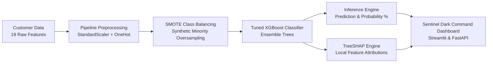

# 🛡️ ChurnGuard AI — Predictive Customer Churn Analytics & Explainability (XAI) Platform

[](https://python.org)
[](https://xgboost.readthedocs.io)
[](https://shap.readthedocs.io)
[](https://scikit-learn.org)
[](https://fastapi.tiangolo.com)
[](https://streamlit.io)

---

## 📌 Executive Summary

Acquiring new customers costs **5x to 25x more** than retaining existing ones. **ChurnGuard AI** is an end-to-end Machine Learning and Explainable AI (XAI) solution designed to proactively identify customers at risk of churn and uncover the underlying factors influencing their decision.

By coupling a **tuned XGBoost classification pipeline** with **TreeSHAP (SHapley Additive exPlanations)**, the system shifts churn prevention from reactive guesswork to data-backed, personalized retention strategies.

---

## 🏗️ End-to-End System Architecture



---

## 🎯 Key Technical Highlights & Engineering Depth

### 1. Robust Machine Learning Pipeline
* **Data Processing**: Engineered a unified `ColumnTransformer` handling numerical normalization (`StandardScaler` for `tenure`, `MonthlyCharges`, `TotalCharges`) and categorical encoding (`OneHotEncoder` with `handle_unknown='ignore'`).
* **Class Imbalance Mitigation**: Utilized **SMOTE (Synthetic Minority Over-sampling Technique)** inside an `imblearn.pipeline.Pipeline` to synthesize minority class samples during training, preventing majority class bias without data leakage.
* **Algorithm Selection**: Tuned an **XGBoost (Extreme Gradient Boosting)** ensemble classifier, optimizing for **ROC-AUC** and **F1-Score** to penalize false negatives (missed churners).

### 2. Explainable AI (XAI) with TreeSHAP
Traditional ML models operate as black boxes, making business adoption difficult. ChurnGuard AI integrates **Game-Theoretic Shapley Values**:
* **Local Feature Attribution**: Calculates the exact mathematical contribution (+/- log-odds impact) of each attribute for an individual customer.
* **Risk Categorization**:
  * 🔴 **Churn Drivers (+)**: Quantifies features pulling the customer toward cancellation (e.g., month-to-month contracts, electronic check payment, unbundled security).
  * 🟢 **Retention Anchors (-)**: Pinpoints loyalty factors (e.g., long tenure, two-year contracts, active tech support).
* **Automated Natural Language Insights**: Translates complex Shapley matrices into dynamic human-readable executive summaries.

### 3. Production Microservice & Interactive Dashboards
* **FastAPI Backend (`api.py`)**: Asynchronous RESTful endpoint (`POST /predict`) delivering sub-50ms inference with real-time SHAP computations.
* **Sentinel Dark Command Center (`app.py` / `index.html`)**: Interactive 3-column command dashboard featuring custom segmented controls, live risk meter gauges, and dynamic SHAP divergence bar charts.

---

## 📊 Business Insights & Domain Findings

Analysis of feature importance and TreeSHAP attribution distributions revealed crucial customer behavior patterns:

| Rank | Feature / Factor | Impact on Churn | Business Implication & Strategic Action |
| :---: | :--- | :---: | :--- |
| **#1** | **Contract Type** | 🔴 Extreme (+SHAP) | Month-to-month subscribers exhibit the highest churn probability. Offering multi-month discounted lock-in plans dramatically reduces risk. |
| **#2** | **Tenure Length** | 🟢 Strong (-SHAP) | Churn risk peaks within the first **1–6 months** (onboarding friction). Loyalty compounding begins after 12+ months. |
| **#3** | **Internet & Add-ons** | 🔴 / 🟢 Dual | Fiber-optic users without bundled **Tech Support** or **Online Security** churn faster due to unaddressed technical issues. Bundling support services significantly improves retention. |
| **#4** | **Payment Method** | 🔴 Moderate (+SHAP) | Electronic check users have higher churn rates compared to automated credit card/bank transfer autopay subscribers. |

---

## 🛠️ Technology Stack & Tools

* **Core Machine Learning**: `Python`, `XGBoost`, `scikit-learn`, `imbalanced-learn (SMOTE)`, `SHAP`
* **Data Processing & Analysis**: `Pandas`, `NumPy`, `Joblib`
* **API & Backend**: `FastAPI`, `Uvicorn`, `Pydantic`
* **Frontend & Visualization**: `Streamlit`, `Vanilla CSS (Sentinel Dark Design System)`, `HTML5/JavaScript`

---

## 💼 Resume Project Summary

```text
ChurnGuard AI | Predictive Customer Churn Analytics & Explainability Platform
• Developed an end-to-end churn prediction pipeline using Tuned XGBoost and SMOTE oversampling on 19 customer features.
• Integrated TreeSHAP (Explainable AI) to compute real-time local feature attributions, identifying primary churn drivers and retention anchors for personalized intervention.
• Engineered a production-grade FastAPI REST microservice and an interactive 3-column Sentinel Dark analytics dashboard in Streamlit.
```
